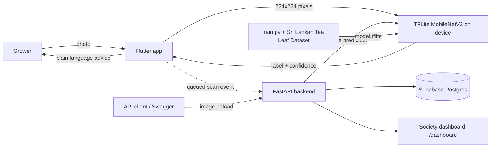

# KolaCheck 🍃
Early tea leaf disease detection for Sri Lankan smallholder growers. Photo in, plain-language answer out (Sinhala / Tamil / English), model runs on the phone, results sync when signal returns.

## Architecture

## Run it
1. Follow [training setup and evaluation](training/README.md) to train and measure the TFLite artifact.
2. Follow [backend setup and API guide](backend/README.md) to run the model and API without Flutter.
3. The Flutter app can still run inference locally on the device; its existing scan route remains compatible.

## Honest limits
- Accuracy numbers come from `training/metrics.json` on dataset images; field accuracy on real phone photos is tested separately (see docs).
- The app gives likely condition and next steps, never chemical dosages.
- `/api/v1/demo/seed` creates fake rows for local demos; the dashboard labels them.
- Backend APIs are versioned under `/api/v1`. Public production access is disabled until authentication and society-level authorization are implemented.
- Sinhala/Tamil text needs native-speaker review.
