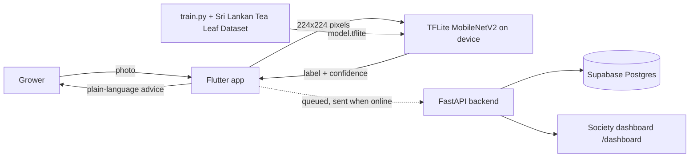

# KolaCheck 🍃
Early tea leaf disease detection for Sri Lankan smallholder growers. Photo in, plain-language answer out (Sinhala / Tamil / English), model runs on the phone, results sync when signal returns.

## Architecture

## Run it
1. `cd training && pip install -r requirements.txt && python train.py /path/to/data` (creates `app/assets/model.tflite`)
2. `cd backend && pip install -r requirements.txt && uvicorn main:app --host 0.0.0.0 --port 8000` (open `/dashboard`)
3. `cd app && flutter create . && flutter pub get && flutter run` (set `backendUrl` in `lib/main.dart`)

## Honest limits
- Accuracy numbers come from `training/metrics.json` on dataset images; field accuracy on real phone photos is tested separately (see docs).
- The app gives likely condition and next steps, never chemical dosages.
- `/api/demo-seed` creates fake rows for demos; the dashboard labels them.
- Sinhala/Tamil text needs native-speaker review.
